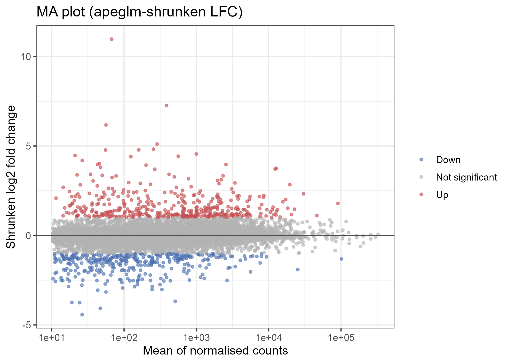
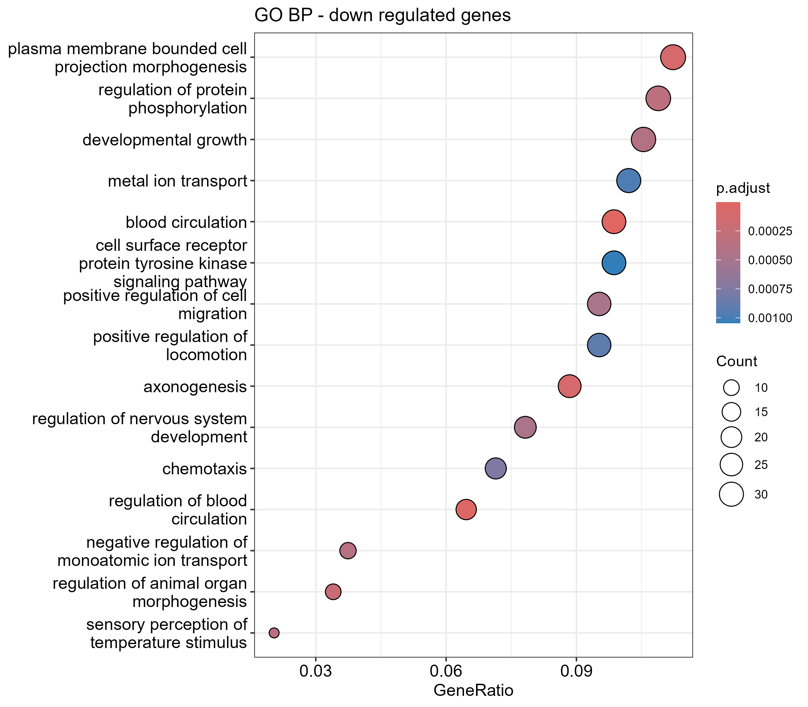
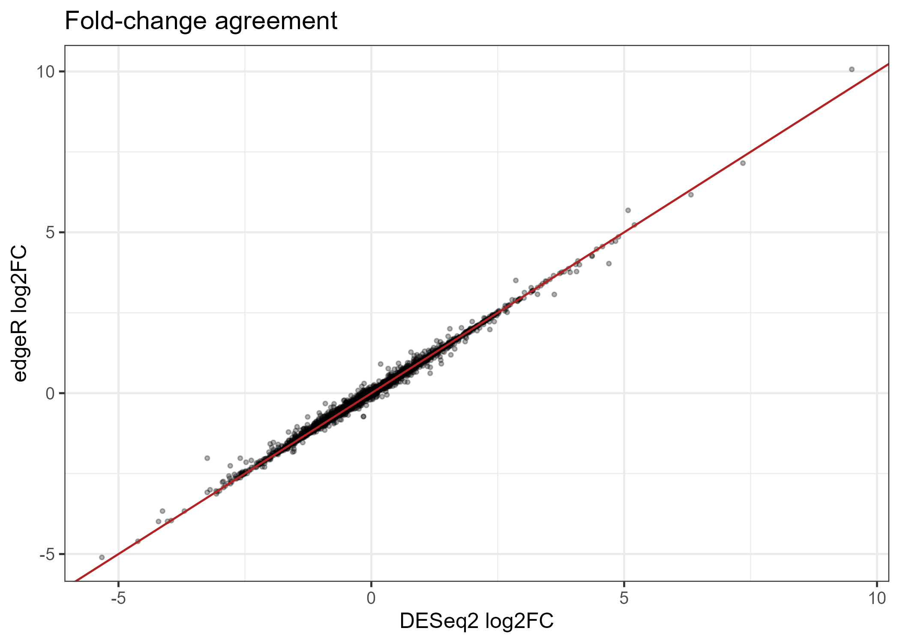

<<<<<<< HEAD
# Dexamethasone response in airway smooth muscle cells: an RNA-seq differential expression pipeline

A reproducible R pipeline taking the Bioconductor `airway` dataset from raw counts to biological interpretation: paired DESeq2 modelling, QC, shrunken fold changes, annotated results, pathway enrichment (GO, KEGG, GSEA) and cross-validation against edgeR and limma-voom.
https://jbel254.github.io/Dexamethasone-response-in-airway-smooth-muscle-cells-an-RNA-seq-differential-expression-pipeline/
**Dataset:** Himes *et al.* (2014), four human airway smooth muscle cell lines, each cultured with and without the synthetic glucocorticoid **dexamethasone** (8 samples, 4 pairs).
**Question:** which genes respond to dexamethasone, and which biological processes do they represent?


## Key findings

| | |
|---|---|
| Genes tested after filtering | XXX |
| Significantly up-regulated (padj < 0.05, shrunken log2FC >= 1) | XXX |
| Significantly down-regulated (padj < 0.05, shrunken log2FC <= -1) | XXX |
| Genes called by all three methods (DESeq2, edgeR, limma-voom) | **912** of 1,076 in the union (85%) |
| Genes called by at least two methods | 1,014 of 1,076 (94%) |

<sub>XXX values: copy from `results/deseq2_summary.txt`, `results/design_comparison.csv`, or run `table(read.csv("results/deseq2_results_all.csv")$direction)`.</sub>

1. **The response is strong and consistent across cell lines.** Treated and untreated samples separate along PC1 (39.9% of variance), and after removing the cell-line effect PC1 explains 81.4% of the remaining variance and separates the two conditions cleanly.
2. **Canonical glucocorticoid-responsive genes behave as expected.** *DUSP1*, *FKBP5*, *KLF15*, *PER1* and *TSC22D3* are induced in all four cell lines, and *DUSP1* and *PER1* appear in the top 40 by significance. This acts as a positive control for the whole pipeline.
3. **Up-regulated genes point to hormone response, tissue remodelling and metabolism.** GO terms include cellular response to hormone stimulus, extracellular matrix organisation, cell-substrate adhesion, muscle system process, fat cell differentiation and D-glucose transport. KEGG highlights *Cytoskeleton in muscle cells* as the strongest term.
4. **Down-regulated genes are enriched for migration, development and signalling.** GO terms include positive regulation of cell migration and locomotion, chemotaxis, axonogenesis and regulation of protein phosphorylation. GSEA also shows suppression of E2F targets, mTORC1 signalling, p53 pathway and interferon alpha response.
5. **Results are robust to method choice.** DESeq2, edgeR and limma-voom agree strongly on both calls and fold changes.

## Results in detail

### Quality control

| | |
|---|---|
|  |  |
| **PCA of VST counts.** PC1 (39.9%) separates treatment; PC2 (23.3%) is driven largely by one cell line (N080611), which is why the model blocks on cell line. | **After removing the cell-line effect.** PC1 now explains 81.4% of variance and splits treated from untreated with no overlap. |

- **Library sizes** range from about 15 to 31 million assigned reads. DESeq2's median-of-ratios normalisation accounts for this ([figure](figures/qc_library_sizes.png)).
- **Sample distances** cluster the four untreated samples together and the four treated samples together ([figure](figures/qc_sample_distances.png)).
- **Dispersion estimates** follow the expected decreasing mean-dispersion trend, with final estimates shrunk toward the fitted curve; outlier genes are circled ([figure](figures/qc_dispersion.png)).
- **P-value histogram** shows a sharp spike near zero over a roughly uniform background, the signature of a well-behaved test with a real signal ([figure](figures/qc_pvalue_histogram.png)).

### Differential expression

Using a paired design (`~ cellLine + dexamethasone`), the strongest up-regulated genes include *CACNB2*, *SPARCL1*, *DUSP1*, *SAMHD1*, *MAOA*, *GPX3*, *STEAP2*, *NEXN*, *MT2A*, *FGD4*, *ADAMTS1*, *PDPN*, *SORT1* and *PER1*. The most significant down-regulated gene is *VCAM1*.

| | |
|---|---|
|  |  |
| Top 40 DE genes (row z-scores of VST counts). Samples split by treatment, not by cell line. | MA plot of apeglm-shrunken log2 fold changes. Shrinkage tames noisy low-count genes. |

Top-gene tables: [`results/top20_up.csv`](results/top20_up.csv), [`results/top20_down.csv`](results/top20_down.csv). Full results: [`results/deseq2_results_all.csv`](results/deseq2_results_all.csv).

### Positive-control genes


Five of six genes shown are induced in every cell line (lines connect paired samples). *CDKN1C* is the exception: it rises in three cell lines but falls in N080611, so it is a weaker and less consistent marker in this dataset.

### Functional enrichment

**GSEA (MSigDB Hallmark, FDR < 0.05)** finds 14 gene sets: ten positively and four negatively enriched in treated cells.


- **Up in treated:** adipogenesis (strongest), TNF-alpha signalling via NF-kB, androgen response, IL2-STAT5 signalling, UV response (down genes), xenobiotic metabolism, complement, fatty acid metabolism, oxidative phosphorylation and hypoxia.
- **Down in treated:** mTORC1 signalling, E2F targets, interferon alpha response and p53 pathway.
- The running-score curves for the top sets peak early, meaning the enrichment is driven by genes near the top of the ranking ([figure](figures/gsea_running_scores.png)).

**GO Biological Process over-representation** (redundant terms collapsed, background = all tested genes):

| Up-regulated genes | Down-regulated genes |
|---|---|
|  |  |

**KEGG (up-regulated genes):** *Cytoskeleton in muscle cells* is the strongest hit, followed by *Mineral absorption* and *Tyrosine metabolism* ([figure](figures/kegg_up.png)).

### Cross-validation with other methods

| | |
|---|---|
|  |  |

All three methods use the same paired design and gene set. 912 genes are significant in all three, and only 29 (DESeq2), 18 (edgeR) and 15 (limma-voom) are unique to a single method. DESeq2 and edgeR log2 fold changes lie almost exactly on the identity line.

## Interpretation notes and limitations

- **Sample size is small** (4 pairs). Effect-size thresholds and the paired design matter more here than in larger studies.
- **GSEA effect sizes are moderate** (|NES| below 2), so treat individual pathways as hypotheses rather than conclusions.
- **Read the TNF-alpha/NF-kB hallmark with care.** Glucocorticoids are anti-inflammatory, yet this set is enriched among up-regulated genes. The set contains immediate-early genes, so some overlap with glucocorticoid-inducible genes such as *DUSP1* is likely, and the enrichment should not be read as pro-inflammatory activation. The repressed interferon alpha response fits the expected immunosuppressive effect better.
- **Receptor tyrosine kinase signalling** appears in both the up and down GO lists, driven by different genes. Inspect the member genes in `results/go_bp_*.csv` before drawing conclusions.
- **GO and KEGG** are over-representation tests on thresholded gene lists, so they depend on the cutoffs; GSEA uses the full ranking and is less sensitive to them.
- **No experimental validation.** All findings are computational.

## Pipeline

| Script | Purpose | Main outputs |
|---|---|---|
| `scripts/00_setup.R` | Shared settings, thresholds, plot helpers | |
| `scripts/01_prepare_data.R` | Extract counts and metadata from `airway` | `data/*.csv` |
| `scripts/02_deseq2.R` | Filtering, paired and naive DESeq2, LFC shrinkage, annotation | `results/deseq2_results_all.csv` |
| `scripts/03_qc.R` | Quality-control plots | `figures/qc_*.png` |
| `scripts/04_visualise_results.R` | Volcano, MA, heatmap, known-gene plots | `figures/volcano.png`, etc. |
| `scripts/05_enrichment.R` | GO, KEGG, GSEA | `results/go_*.csv`, `results/gsea_hallmark.csv` |
| `scripts/06_method_comparison.R` | edgeR and limma-voom cross-check | `results/method_overlap.csv` |

## Quick start

```bash
git clone https://github.com/<you>/<repo>.git
cd <repo>

Rscript install_packages.R   # one-off
Rscript run_all.R            # runs all six steps
quarto render report.qmd     # optional: builds report.html
```

All scripts must be run from the project root. Thresholds (`padj_cut`, `lfc_cut`) are set in `scripts/00_setup.R`.

## Methods summary

1. **Filtering:** genes with at least 10 reads in at least 4 samples are kept.
2. **Model:** DESeq2 negative binomial GLM, `~ cellLine + dexamethasone`, reference level `untreated`; Wald test with Benjamini-Hochberg adjustment.
3. **Calls:** padj < 0.05 and |apeglm-shrunken log2FC| >= 1.
4. **Enrichment:** over-representation uses all tested genes as background; GSEA ranks genes by Wald statistic against MSigDB Hallmark sets.
5. **Validation:** edgeR (quasi-likelihood) and limma-voom on the same design and gene set, compared with unshrunken log2FC.

## Repository layout

```
.
├── README.md
├── report.qmd
├── run_all.R
├── install_packages.R
├── scripts/      # numbered analysis steps
├── data/         # generated count matrix and sample sheet
├── results/      # tables (CSV) and session info
└── figures/      # PNG figures
```

## Reproducibility

`results/sessionInfo.txt` records package versions from the last run. For strict pinning, run `renv::init()` after `install_packages.R` and commit `renv.lock`.

## Reference

Himes BE *et al.* (2014). RNA-Seq transcriptome profiling identifies CRISPLD2 as a glucocorticoid responsive gene that modulates cytokine function in airway smooth muscle cells. *PLoS ONE* 9(6): e99625.

## License

MIT. See `LICENSE`.
=======
# Dexamethasone-response-in-airway-smooth-muscle-cells-an-RNA-seq-differential-expression-pipeline
A reproducible R pipeline taking the Bioconductor airway dataset from raw counts to biological interpretation: paired DESeq2 modelling, QC, shrunken fold changes, annotated results, pathway enrichment (GO, KEGG, GSEA) and cross-validation against edgeR and limma-voom.
>>>>>>> e62f299d5cbc14469f1dd58154cd5ab23df90fbc
