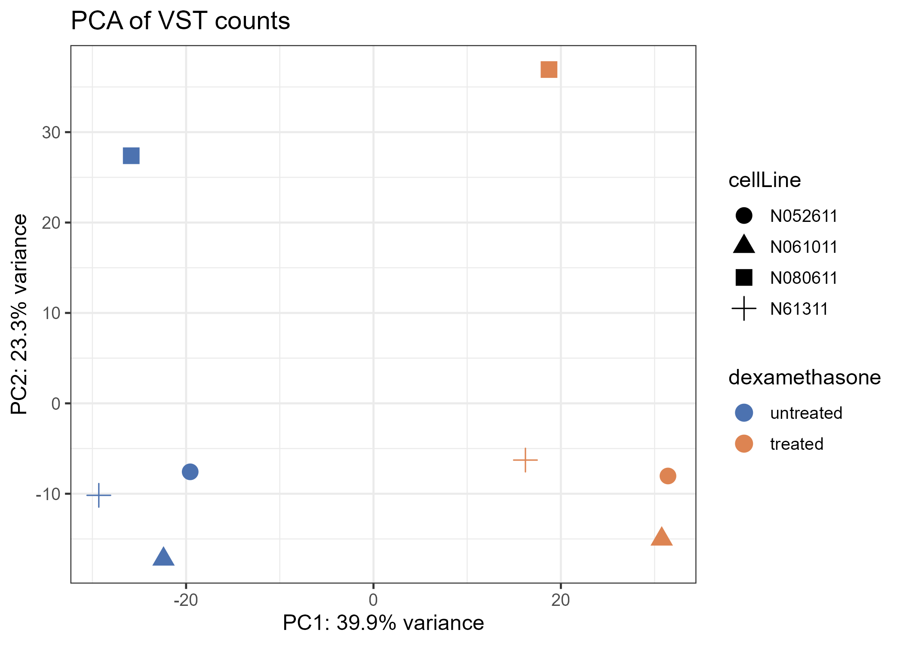
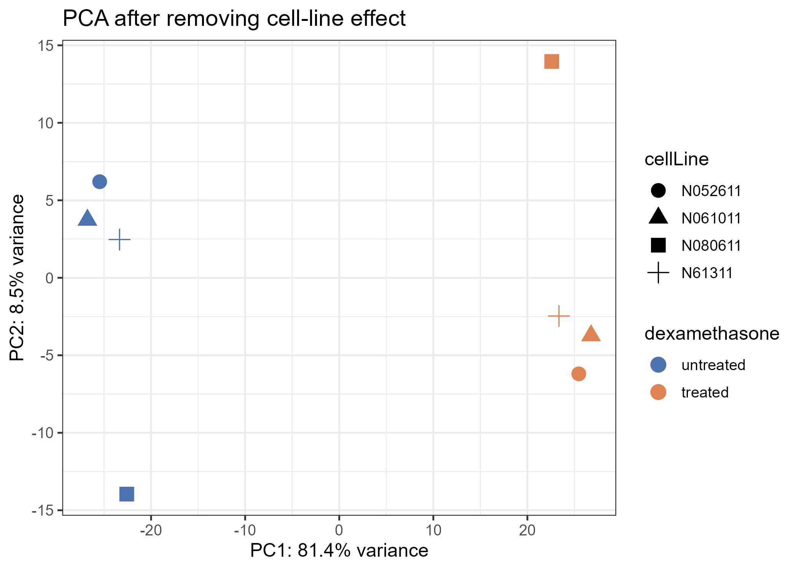
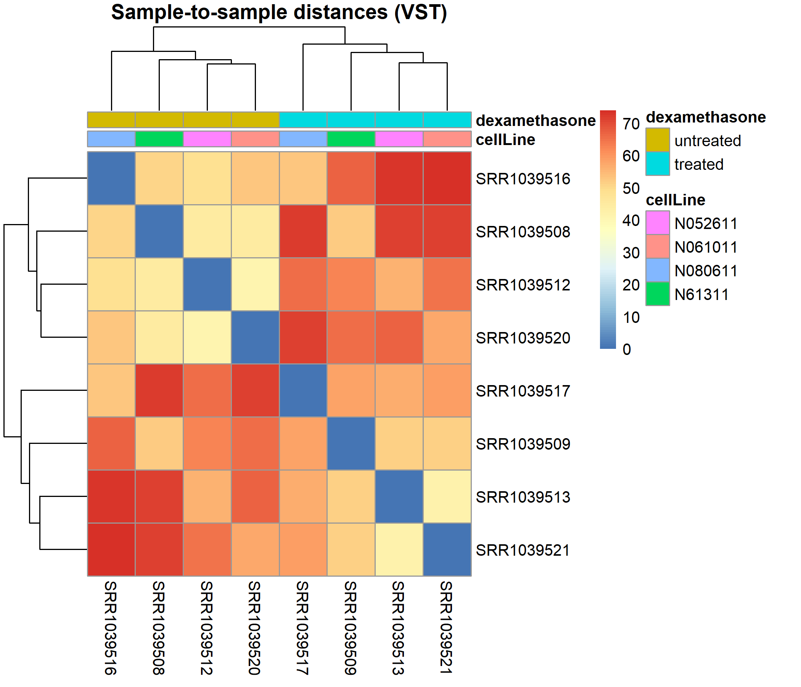
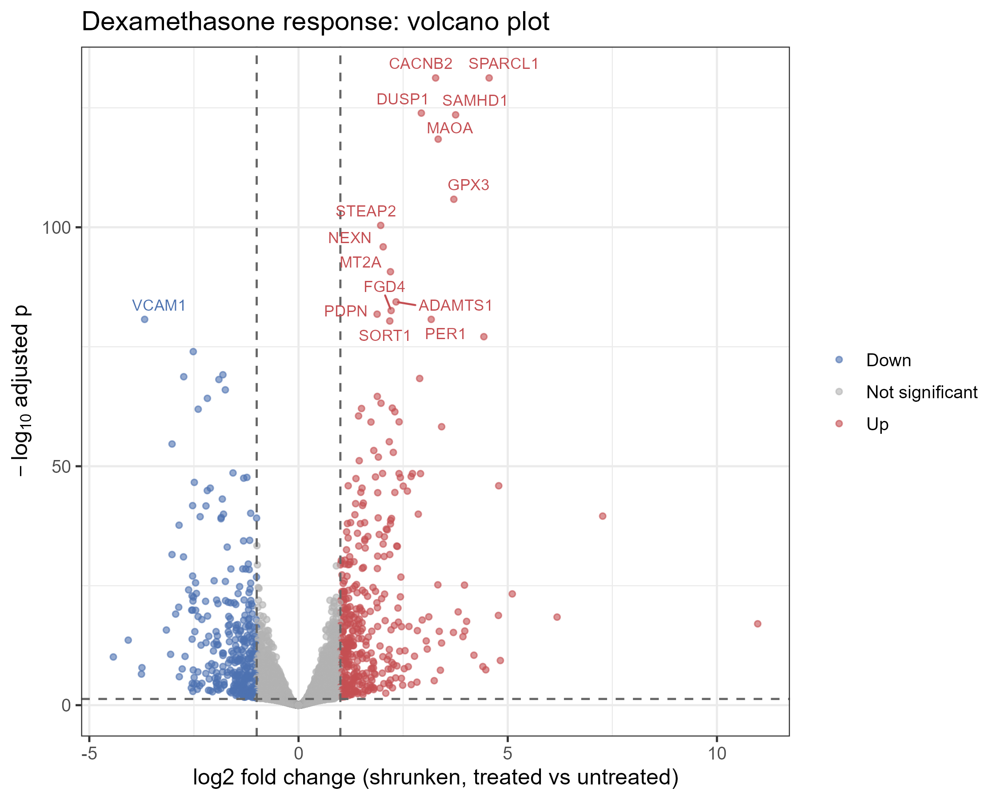
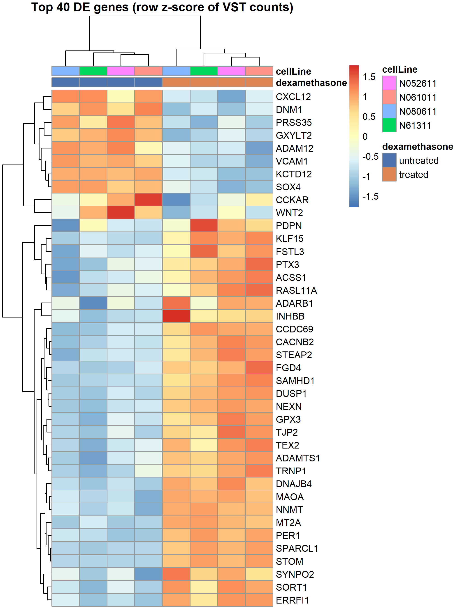
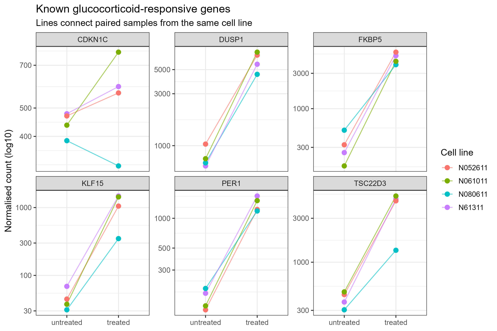
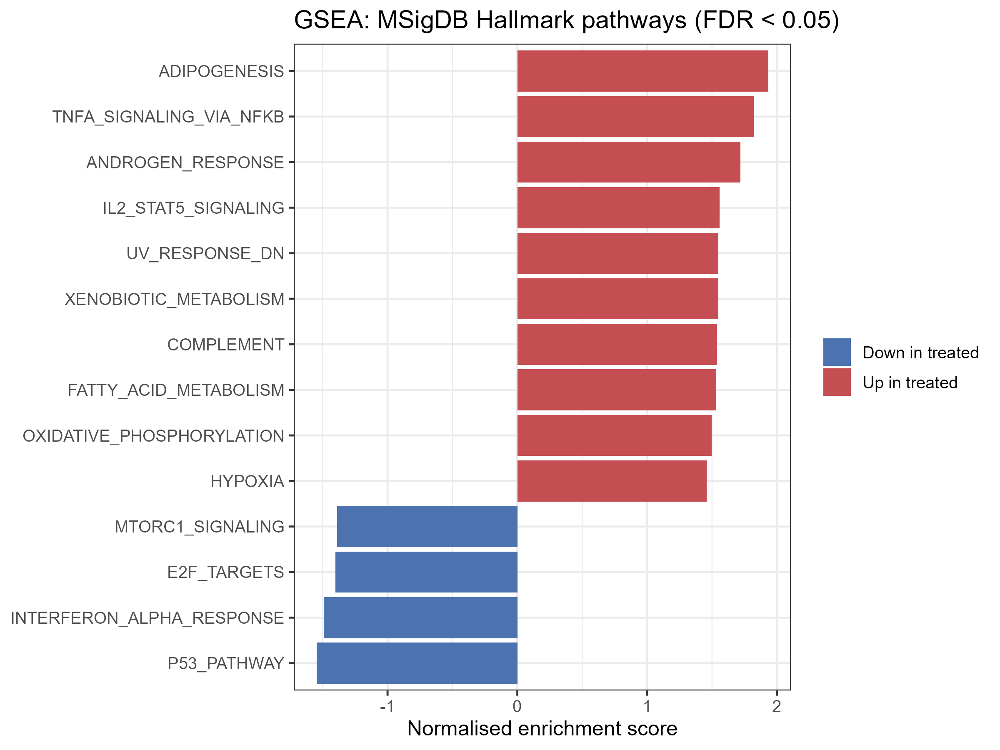
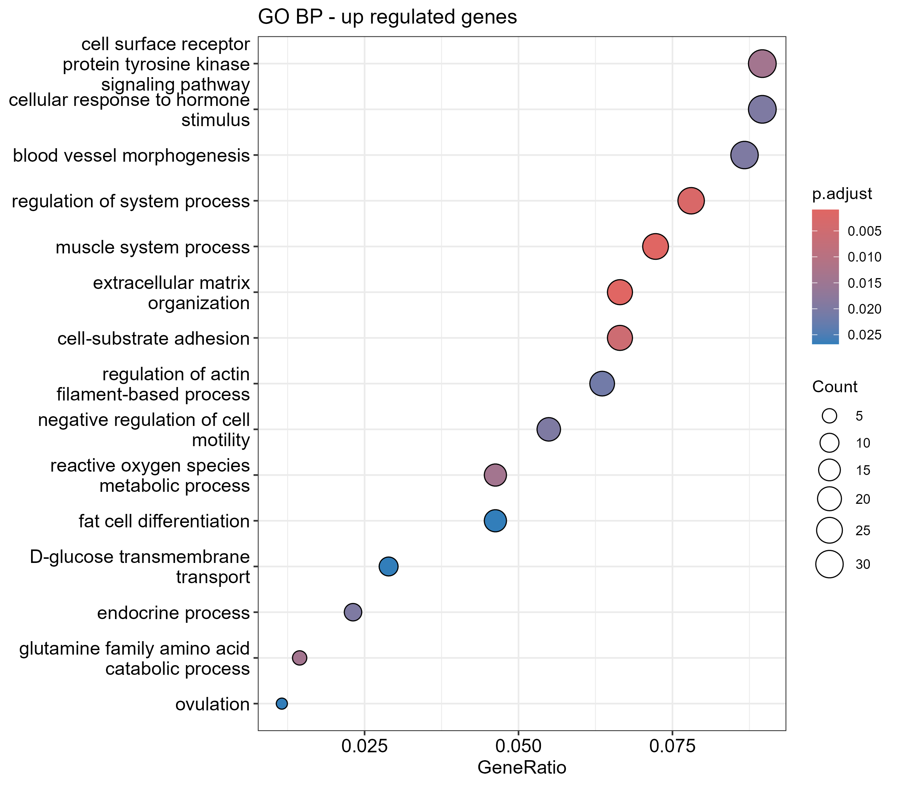
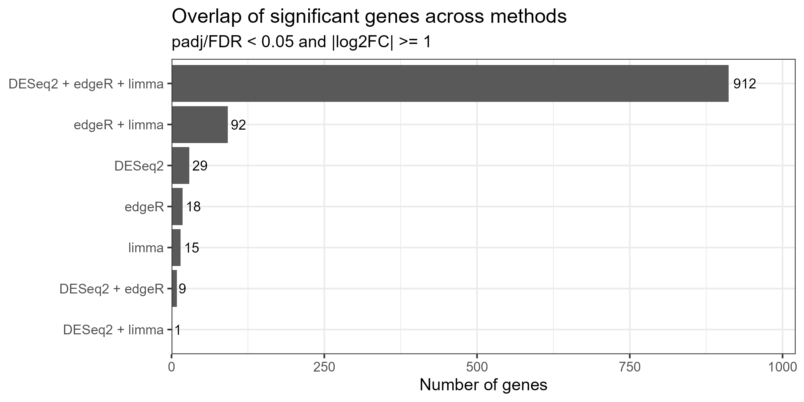

```{r setup}
library(tidyverse)
library(knitr)
res <- read.csv("results/deseq2_results_all.csv")
design_cmp <- read.csv("results/design_comparison.csv")
n_up   <- sum(res$direction == "Up")
n_down <- sum(res$direction == "Down")
```

## Background

This report analyses the `airway` dataset (Himes *et al.* 2014): four human
airway smooth muscle cell lines, each cultured with and without the
glucocorticoid dexamethasone. The question: **which genes respond to
dexamethasone, and what biology do they represent?**

Because every cell line contributes one treated and one untreated sample, the
model blocks on cell line (`~ cellLine + dexamethasone`).

## Quality control

{width=48%}
{width=48%}

{width=60%}

## Differential expression

Using padj < 0.05 and |shrunken log2FC| >= 1, we find **`r n_up`** up- and
**`r n_down`** down-regulated genes.

Modelling the pairing increases power:

```{r}
kable(design_cmp, col.names = c("Design", "Genes with padj < 0.05"))
```

{width=70%}

{width=70%}

### Sanity check: known glucocorticoid-responsive genes

{width=80%}

### Top up-regulated genes

```{r}
kable(head(read.csv("results/top20_up.csv"), 10), digits = 3)
```

## Functional enrichment

{width=70%}

{width=70%}

## Robustness across methods

{width=70%}

## Session info

```{r}
cat(readLines("results/sessionInfo.txt"), sep = "\n")
```
